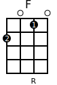
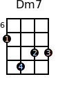
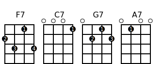

# Creating Ukulele Chord Diagrams in SVG with Python

With the Python modul __uchord__ you can create ukulele chord diagrams in SVG format.   


```python
import uchord

uchord.write_chord('c.svg','C','0003')
```

<br><br><br><br><br>

If you like it, use it. If you have some suggestions, tell me (gkvoelkl@nelson-games.de).

# Thanks

Special thanks to the project https://github.com/pianosnake/uke-chord where I learned much about 
SVG and chord diagrams. I recycled some of the svg commands.

# Installation

* First you need Python 3 (https://www.python.org, ) - Python 3.6 should work, because it's the development environment
* And this modul uchord - simply copy the source

Or try


```python
pip install uchord
```

That should work.

# Changelog

|Version       |                                                                                          |
|--------------|------------------------------------------------------------------------------------------|
|  0.1.0       | To start with|

# Example

The ukulele chord diagrams are a picture of the fretboard.
The four strings are the vertical lines. The dots are the places where your fingers should be.

<br><br><br><br><br>

For example the F major chord. You have to put one finger at the __second__ fret of the first string and one at the __first__ fret of the third string. String two and four are empty.


The number *2010* represents the F chord. Every digit stands for a string. This representation is used in *uchord*, too.


```python
import uchord

uchord.write_chord('f.svg','F','2010')
```

If you want to specify which finger should be used for which fret, use the paremeter *fingers*. For an empty string stands the underline.


```python
uchord.write_chord('f.svg','F','2010',fingers='2_1_')
```

<br><br><br><br><br>

For marking the root note or other texts under the chord you can use the parmeter *subtexts*


```python
uchord.write_chord('f.svg','F','2010',fingers='2_1_',subtexts='__R_')
```

<br><br><br><br><br>

If a chord is played higher up the fret, you can specify the fret to start with. Parameter *starting_fret*


```python
uchord.write_chord('dm7.svg','Dm7','7988',fingers='1423',starting_fret=6)
```

<br><br><br><br><br>

## Using Class Chord and Chords

The modul *uchord* has the class *Chord* which reprents a specific chord.


```python
from uchord import Chord

c = Chord('F','2010',fingers='2_1_',subtexts='__R_')
```

With the method *to_svg* you get the svg string


```python
svg = c.to_svg()
```

The class *Chords* stands for a list of chords.


```python
from uchord import Chords

c = Chords([Chord("F7","2313",fingers="2314",subtexts="__R_"),
            Chord("C7","0001",fingers="___1",subtexts="_R__"),
            Chord("G7","0212",fingers="_213",subtexts="R___"),
            Chord("A7","0100",fingers="_1__",subtexts="___R")])
svg = c.to_svg()
```

## With IPython and Jupyter

With *IPython.display* you can use the chords in a notebook.


```python
from IPython.display import SVG, display
from uchord import Chords

c = Chords([Chord("F7","2313",fingers="2314",subtexts="__R_"),
            Chord("C7","0001",fingers="___1",subtexts="_R__"),
            Chord("G7","0212",fingers="_213",subtexts="R___"),
            Chord("A7","0100",fingers="_1__",subtexts="___R")])

display(SVG(c.to_svg()))
```





You can define your magic command for chords


```python
from IPython.core.magic import register_cell_magic
from IPython.display import SVG, display

from uchord import Chord, Chords

@register_cell_magic
def uchord(line, cell):
    
    lines = cell.splitlines()
    chordlist = []
    name = "" 
    frets = ""
    starting_fret=1
    fingers=""
    subtexts=""
    
    for l in lines:
        tokens = l.split(',')

        name = tokens[0].strip()
        frets = tokens[1].strip()
        
        for t in tokens[2:]:
            arg = t.split('=')
            argname = arg[0].strip()
            if argname.upper() == "FINGERS":
                fingers = arg[1].strip()
            elif argname.upper() == "SUBTEXTS":
                subtexts = arg[1].strip()
            elif argname.upper() == "STARTING_FRET":
                starting_fret = int(arg[1])
                
        chordlist.append(Chord(name, frets, fingers=fingers, subtexts=subtexts, starting_fret=starting_fret))
    
    return display(SVG(Chords(chordlist).to_svg()))
```

to use


```python
%%uchord
A7, 0100, fingers=_1__, subtexts=___R
G7, 0212, fingers=_213, subtexts=R__3
F7, 2313, fingers=2314, subtexts=__R5
C7, 0001, fingers=___1, subtexts=_R_7
```


# Source

uke-chord https://github.com/pianosnake/uke-chord

How to read chord https://ukulele-chords.com/faq/how-to-read-chord


```python

```
