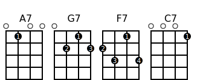
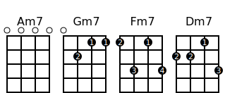
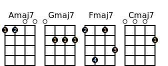
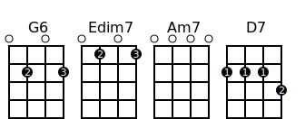
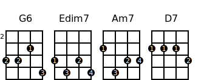
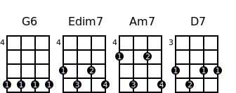

# Creating Ukulele Chord Diagrams in SVG with Python

With the Python modul __uchord__ you can create ukulele chord diagrams in SVG format.   


```python
import uchord

uchord.write_chord('c.svg','C','0003')
```

<br><br><br><br><br>

If you like it, use it. If you have some suggestions, tell me (gkvoelkl@nelson-games.de).

# Thanks

Special thanks to the project https://github.com/pianosnake/uke-chord where I learned much about 
SVG and chord diagrams. I recycled some of the svg commands.

# Installation

* First you need Python 3 (https://www.python.org, ) - Python 3.6 should work, because it's the development environment
* And this modul uchord - simply copy the source

Or try


```python
pip install uchord
```

That should work.

# Changelog

|Version       |                                                                                          |
|--------------|------------------------------------------------------------------------------------------|
|  0.1.0       | To start with|

# Example

The ukulele chord diagrams are a picture of the fretboard.
The four strings are the vertical lines. The dots are the places where your fingers should be.

<br><br><br><br><br>

For example the F major chord. You have to put one finger at the __second__ fret of the first string and one at the __first__ fret of the third string. String two and four are empty.


The number *2010* represents the F chord. Every digit stands for a string. This representation is used in *uchord*, too.


```python
import uchord

uchord.write_chord('f.svg','F','2010')
```

If you want to specify which finger should be used for which fret, use the paremeter *fingers*. For an empty string stands the underline.


```python
uchord.write_chord('f.svg','F','2010',fingers='2_1_')
```

<br><br><br><br><br>

For marking the root note or other texts under the chord you can use the parmeter *subtexts*


```python
uchord.write_chord('f.svg','F','2010',fingers='2_1_',subtexts='__R_')
```

<br><br><br><br><br>

If a chord is played higher up the fret, you can specify the fret to start with. Parameter *starting_fret*


```python
uchord.write_chord('dm7.svg','Dm7','7988',fingers='1423',starting_fret=6)
```

<br><br><br><br><br>

## Using Class Chord and Chords

The modul *uchord* has the class *Chord* which reprents a specific chord.


```python
from uchord import Chord

c = Chord('F','2010',fingers='2_1_',subtexts='__R_')
```

With the method *to_svg* you get the svg string


```python
svg = c.to_svg()
```

The class *Chords* stands for a list of chords.


```python
from uchord import Chords

c = Chords([Chord("F7","2313",fingers="2314",subtexts="__R_"),
            Chord("C7","0001",fingers="___1",subtexts="_R__"),
            Chord("G7","0212",fingers="_213",subtexts="R___"),
            Chord("A7","0100",fingers="_1__",subtexts="___R")])
svg = c.to_svg()
```

## With IPython and Jupyter

With *IPython.display* you can use the chords in a notebook.


```python
from IPython.display import SVG, display
from uchord import Chords, Chord

c = Chords([Chord("F7","2313",fingers="2314",subtexts="__R_"),
            Chord("C7","0001",fingers="___1",subtexts="_R__"),
            Chord("G7","0212",fingers="_213",subtexts="R___"),
            Chord("A7","0100",fingers="_1__",subtexts="___R")])

display(SVG(c.to_svg()))
```


    

    


```python
with open('chords.svg', 'w') as f:
        f.write(c.to_svg())
```

You can define your magic command for chords


```python
from IPython.core.magic import register_cell_magic
from IPython.display import SVG, display

from uchord import Chord, Chords

@register_cell_magic
def uchord(line, cell):
    
    lines = cell.splitlines()
    chordlist = []
    name = "" 
    frets = ""
    starting_fret=-1
    fingers=""
    subtexts=""
    
    for l in lines:
        tokens = l.split(',')

        name = tokens[0].strip()
        frets = tokens[1].strip()
        
        for t in tokens[2:]:
            arg = t.split('=')
            argname = arg[0].strip()
            if argname.upper() == "FINGERS":
                fingers = arg[1].strip()
            elif argname.upper() == "SUBTEXTS":
                subtexts = arg[1].strip()
            elif argname.upper() == "STARTING_FRET":
                starting_fret = int(arg[1])
                
        chordlist.append(Chord(name, frets, fingers=fingers, subtexts=subtexts, starting_fret=starting_fret))
    
    return display(SVG(Chords(chordlist).to_svg()))
```

to use


```python
%%uchord
A7, 0100, fingers=_1__, subtexts=___R
G7, 0212, fingers=_213, subtexts=R__3
F7, 2313, fingers=2314, subtexts=__R5
C7, 0001, fingers=___1, subtexts=_R_7
```


    

    


# Songs

## Bonnie und Clyde

Verse


```python
%%uchord
G, 0232
Em7, 0202
A7sus4, 0200
Cadd9, 0203
```


    

    


```python
%%uchord
D, 2220
Dsus2, 2200
```


    

    


Pre Chorus


```python
%%uchord
Cadd9, 0203
Dadd11, 2230
Em7, 0202
```


    

    


## II V I

### V


```python
%%uchord
A7, 0100, fingers=_1__, subtexts=___R
G7, 0212, fingers=_213, subtexts=R__3
F7, 2313, fingers=2314, subtexts=__R5
C7, 0001, fingers=___1, subtexts=_R_7
```


    

    


### II


```python
%%uchord
Am7, 0000, fingers=____, subtexts=___R
Gm7, 0211, fingers=_211, subtexts=R__3
Fm7, 1313, fingers=2314, subtexts=__R5
Dm7, 2213, fingers=2213, subtexts=_R_7
```


    

    


### I


```python
%%uchord
Amaj7, 1100, fingers=12__, subtexts=___R
Gmaj7, 0222, fingers=_111, subtexts=R__3
Fmaj7, 1413, fingers=2413, subtexts=__R5
Cmaj7, 0002, fingers=___1, subtexts=_R_7
```


    

    


## II V I G


```python
%%uchord
G6, 0202, fingers=_2_3, subtexts=R___
Edim7, 0101, fingers=_2_3
Am7, 0000, subtexts=7__R
D7, 2223, fingers=1112, subtexts=_R_7
```


    

    


```python
%%uchord
G6, 4435, fingers=2213, subtexts=__R_
Edim7, 3434, fingers=1324, subtexts=_R__
Am7, 2433, subtexts=R___
D7, 2223, fingers=1112, subtexts=_R_7
```


    

    


```python
%%uchord
G6, 7777, fingers=1111, subtexts=_R__
Edim7, 6767, fingers=1324, subtexts=___R
Am7, 5757, subtexts=__R_
D7, 5655, fingers=1211, subtexts=____
```


    

    


## chords

| KEY | 1 | 2m | 3m | 4   | 5 | 5-7 | 6m |
|:---:|:------------:|:-----------:|:------:|:------:|:------:|:------:|:------:|
| C ||||||||
| F ||||||||
| Bb ||||||||
| Eb ||||||||
| E ||||||||
| A ||||||||
| D ||||||||
| G ||||||||


```python
import uchord

uchord.write_chord('chords/c.svg','C','0003')
uchord.write_chord('chords/cm.svg','Cm','0333')
uchord.write_chord('chords/c7.svg','C7','0001')
uchord.write_chord('chords/cism.svg','Cism','1102')
uchord.write_chord('chords/d.svg','D','2220')
uchord.write_chord('chords/d7.svg','D7','2223')
uchord.write_chord('chords/dm.svg','Dm','2210')
uchord.write_chord('chords/eb.svg','Eb','3331')
uchord.write_chord('chords/e.svg','E','4442')
uchord.write_chord('chords/e7.svg','E7','1202')
uchord.write_chord('chords/em.svg','Em','0432')
uchord.write_chord('chords/f.svg','F','2010')
uchord.write_chord('chords/fm.svg','Fm','1013')
uchord.write_chord('chords/f7.svg','F7','2313')
uchord.write_chord('chords/fism.svg','Fism','2120')
uchord.write_chord('chords/g.svg','G','0232')
uchord.write_chord('chords/gm.svg','Gm','0231')
uchord.write_chord('chords/g7.svg','G7','0212')
uchord.write_chord('chords/gism.svg','Gism','4342')
uchord.write_chord('chords/ab.svg','Ab','5343')
uchord.write_chord('chords/a.svg','A','2100')
uchord.write_chord('chords/a7.svg','A7','0100')
uchord.write_chord('chords/am.svg','Am','2000')
uchord.write_chord('chords/bb.svg','Bb','3211')
uchord.write_chord('chords/bb7.svg','Bb7','1211')
uchord.write_chord('chords/b.svg','B','4322')
uchord.write_chord('chords/bm.svg','Bm','4222')
uchord.write_chord('chords/b7.svg','B7','2322')
```

# Source

uke-chord https://github.com/pianosnake/uke-chord

How to read chord https://ukulele-chords.com/faq/how-to-read-chord


```python

```
